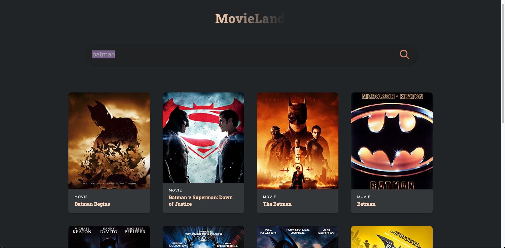
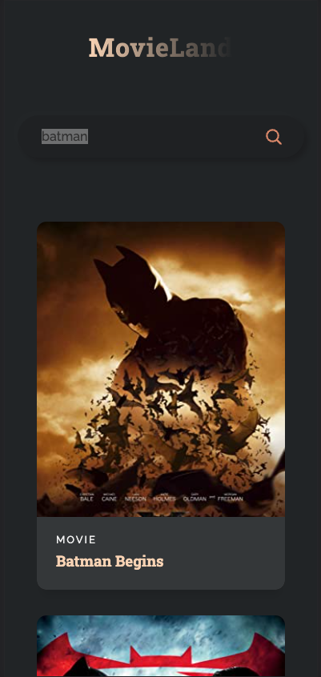

<<<<<<< HEAD
# React movie search application

This application searches the IMDb database for information on movies and will return basic information of that searched movie back in a card. The application is fully mobile responsive and will shrink down when on smaller resolutions.

=======
# React movie seaching application

This application is for searching information on movies from a data base and will return basic information of the movie back in a card.

## Build

Library: REACT
Languages: Javascript, HTML, CSS

